# react-contribution-calendar

 

A GitHub-like contribution calendar component for React, built with Vite and TypeScript. This provides a visual representation of contribution activity, similar to the contribution graph seen on a GitHub profile.

<br />

## Installation

```bash
$ npm i react-contribution-calendar
```

> **Note**  
> Add --save if you are using npm < 5.0.0

<br />

## Demo

[Live Demo](https://codepen.io/yaeheechoe/pen/wvRwJbP)

<br/>

## Usage

```js
import { ContributionCalendar } from 'react-contribution-calendar'

const data = [
  {
    '2020-04-20': {
      level: 2,
    }
  },
  {
    '2023-07-08': {
      level: 1,
    },
  },
  {
    '2023-07-09': {
      level: 4,
      data: {},
    },
  },
  {
    '2023-03-31': {
      level: 3,
      data: {
        myKey: 'my data',
      },
    },
  },
]

<ContributionCalendar
  data={data}
  start="2020-04-04"
  end="2023-05-19"
  daysOfTheWeek={['Sun', 'Mon', 'Tue', 'Wed', 'Thu', 'Fri', 'Sat']}
  textColor="#1F2328"
  startsOnSunday={true}
  includeBoundary={true}
  theme="grass"
  cx={10}
  cy={10}
  cr={2}
  onCellClick={(e, data) => console.log(data)}
/>
```

<br />

## APIs

### `ContributionCalendar`

`ContributionCalendar` is the main component of this library. It takes a data property, which is an array of objects representing the contribution data, and a theme property to customize its appearance.

- **`data`**: An array of objects, where each object has a date string(`YYYY-MM-DD` format) as key, and an `InputDataProps` object as value. Defaults to `[]`.

  - An example data is as follows:
    ```javascript
    const data = [
      {
        '2023-07-08': {
          level: 3,
          data: {
            myKey: 'my data',
          },
        },
      },
      {
        '2023-07-09': {
          level: 1, // `data` attribute could be omitted
        },
      },
    ]
    ```

- **`start`**: Optional. The starting date for the calendar to start, defaults to current year's January 1st(`YYYY-MM-DD` format).
- **`end`**: Optional. The ending date for the calendar to end, defaults to current year's December 31st(`YYYY-MM-DD` format).
- **`daysOfTheWeek`**: Optional. The days of the week, which will be the head column of each row. The array should start from Sunday so that you can use with `startsOnSunday` option correctly. Defaults to `['Sun', 'Mon', 'Tue', 'Wed', 'Thu', 'Fri', 'Sat']`.
- **`textColor`**: Optional. The color of indexes. String color code format, defaults to `#1F2328`.
- **`startsOnSunday`**: Optional. Whether to start the calendar on Sunday or not, defaults to `true`. If set to false, calendar will start on Monday.
- **`includeBoundary`**: Optional. Whether to include the boundary cells in the starting or ending date column, defaults to `true`.
- **`theme`**: Optional. A string that represents a predefined theme name, or an object with custom theme colors. Defaults to `grass`.
- **`cx`**: Optional. The pixel size of width of each cell, defaults to `10`.
- **`cy`**: Optional. The pixel size of height of each cell, defaults to `10`.
- **`cr`**: Optional. The pixel size of border radius of each cell, defaults to `2`.
- **`onCellClick`**: Optional. An onClick mouse event on each table cell.

<br />

### `createTheme`

`createTheme` is a helper function to create custom themes. It takes a string representing a predefined theme name or an object containing custom theme colors. This returns a theme object(`ThemeProps`).

<br />

## Themes

You can customize the appearance of the `<ContributionCalendar />` with the theme property. We provide several built-in themes.

```javascript
// Replace `theme` attribute with belows
<ContributionCalendar theme={'grass'} />
```

### Light Themes

#### `empty`

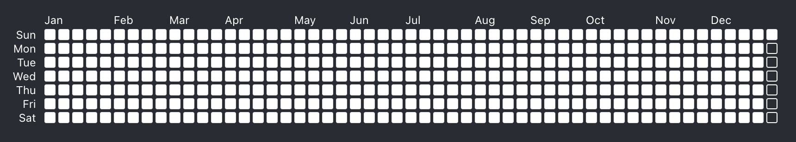

#### `grass`

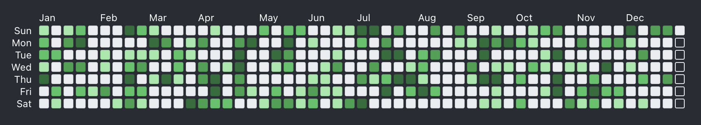

#### `cherry`

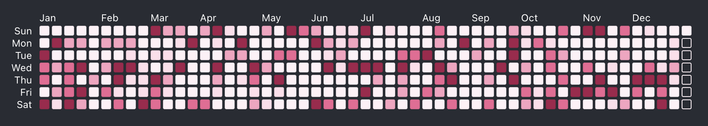

#### `cherry_blossom`

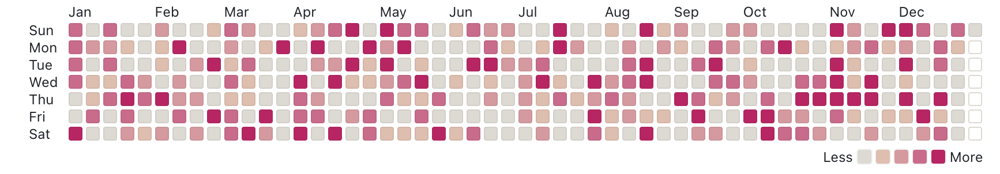

#### `pink`

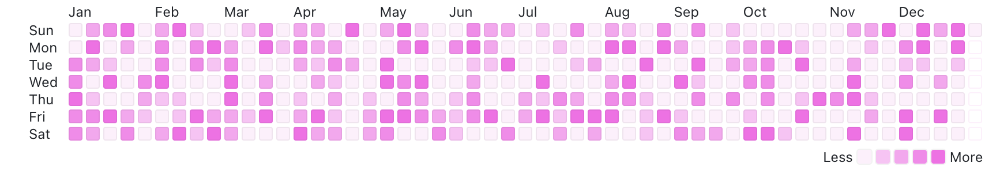

#### `ocean`

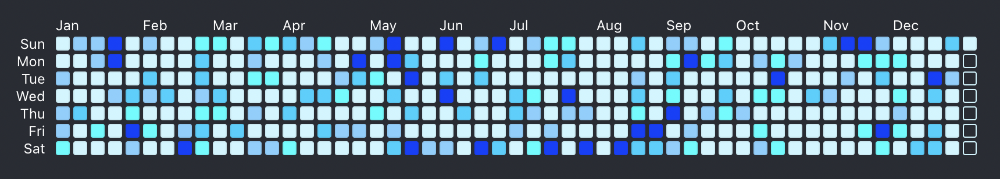

#### `sky`

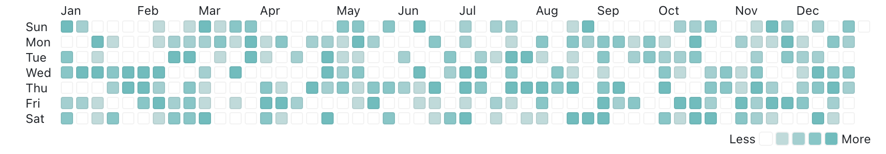

#### `halloween`

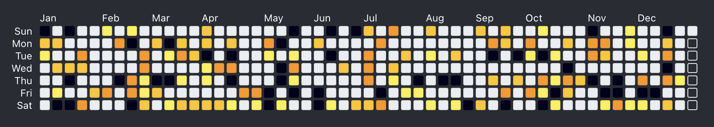

#### `winter`

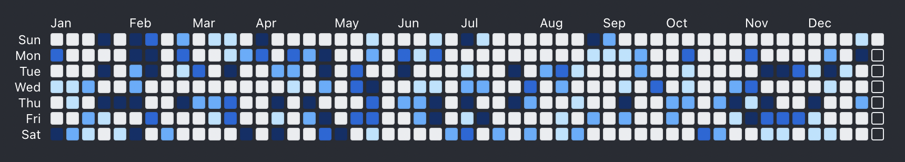

#### `purquoise`

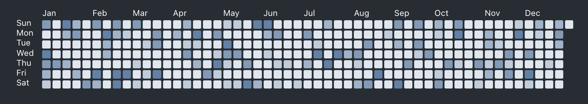

#### `mustard`

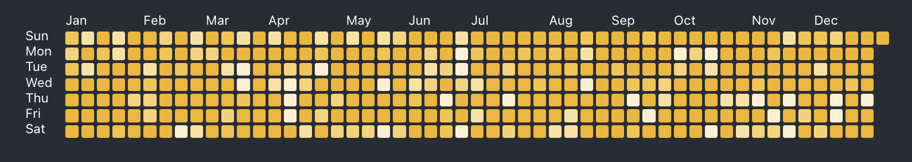

#### `gray`

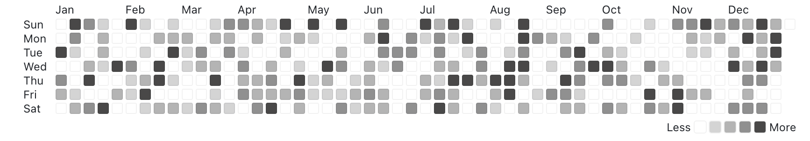

#### `vomit`

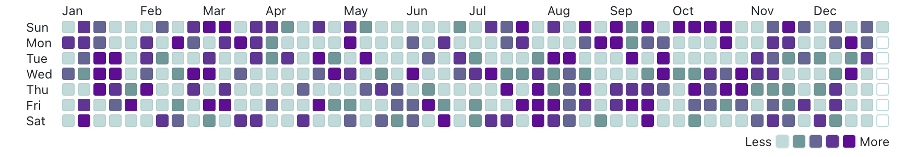

#### `neonpunk`

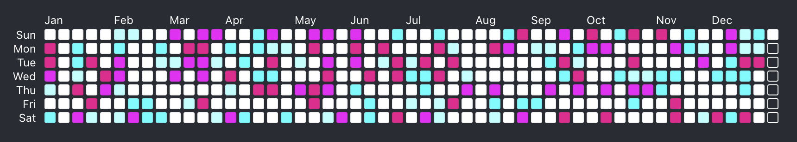

#### `citypop`

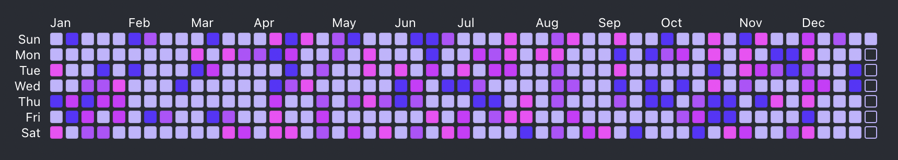

#### `coral`

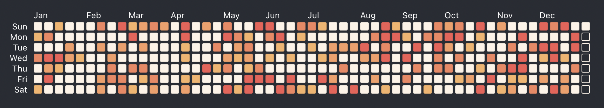

#### `emoji_positive`

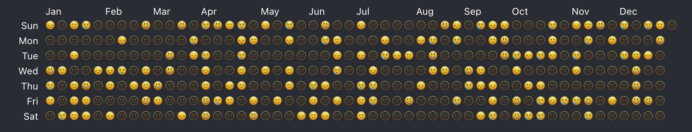

```tsx
emoji_positive: {
  level0: '🫥',
  level1: '😢',
  level2: '😞',
  level3: '🙂',
  level4: '😃',
},
```

#### `emoji_negative`

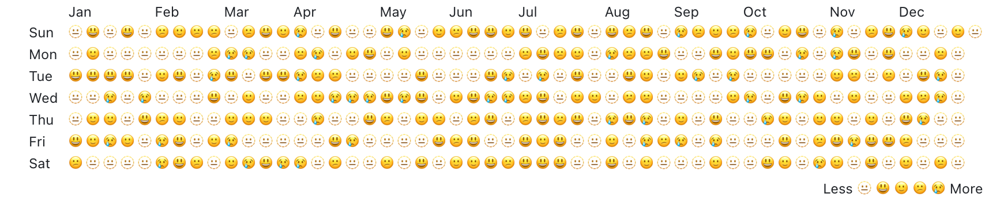

```tsx
emoji_negative: {
  level0: '😃',
  level1: '🙂',
  level2: '😕',
  level3: '😢',
  level4: '🫥',
},
```

<br />

### Dark Themes

#### `dark_empty`

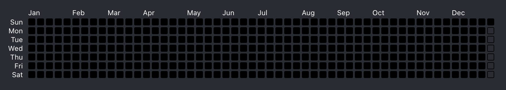

#### `dark_grass`

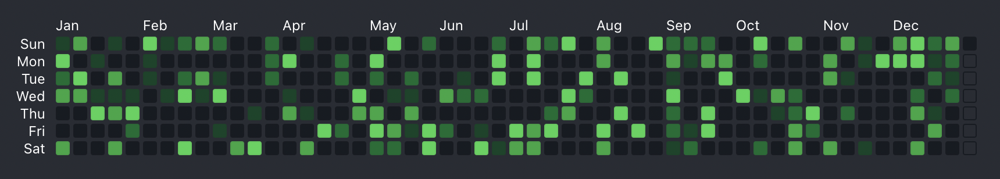

#### `dark_cherry`

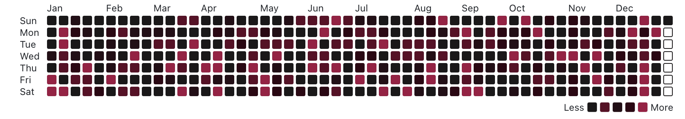

#### `dark_cherry_blossom`


#### `dark_pink`

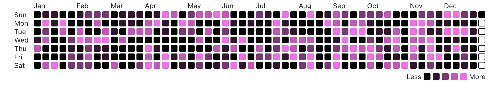

#### `dark_ocean`

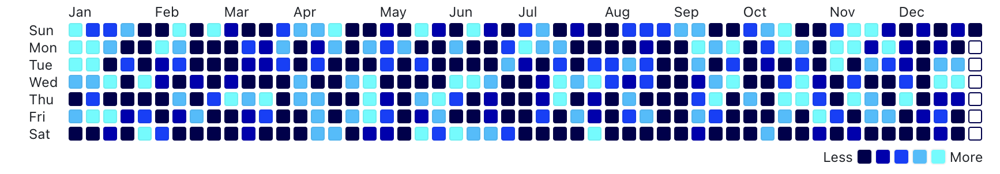

#### `dark_sky`

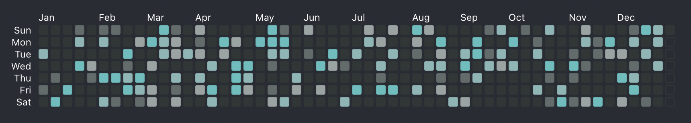

#### `dark_halloween`

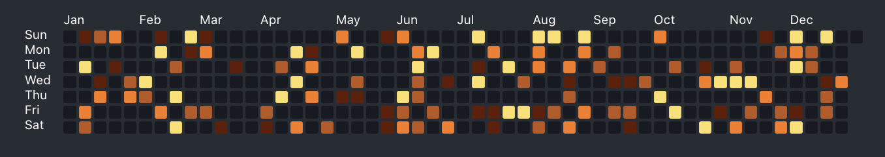

#### `dark_winter`

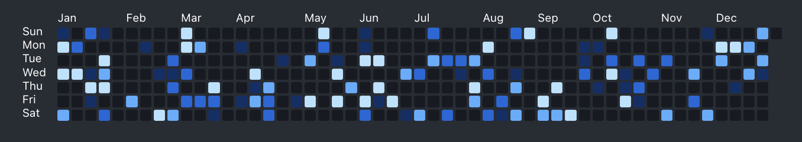

#### `dark_purquoise`


#### `dark_mustard`


#### `dark_gray`

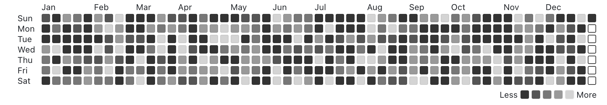

#### `dark_vomit`

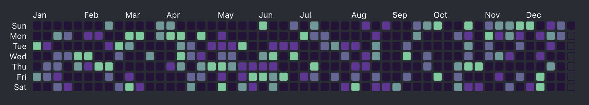

#### `dark_neonpunk`

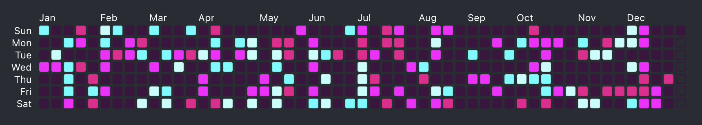

#### `dark_citypop`

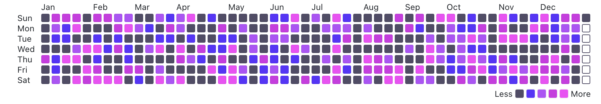

#### `dark_coral`

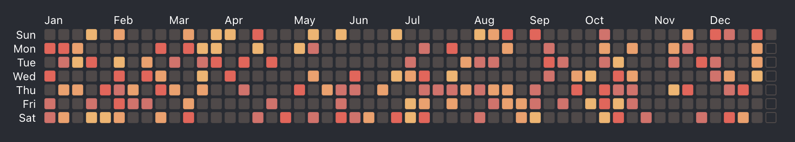

<br />

### Custom Theme

```javascript
import { ContributionCalendar, createTheme } from 'react-contribution-calendar'

function App() {
  /* Define your custom theme */
  const customTheme = createTheme({
    level0: '#ebedf0',
    level1: '#9be9a8',
    level2: '#40c463',
    level3: '#30a14e',
    level4: '#216e39',
  })

  return <ContributionCalendar theme={customTheme} />
}
```

Or you can set theme properties directly,

```javascript
import { ContributionCalendar } from 'react-contribution-calendar'

function App() {
  return (
    <ContributionCalendar
      theme={{
        /* Assign theme properties directly */
        level0: '#ebedf0',
        level1: '#9be9a8',
        level2: '#40c463',
        level3: '#30a14e',
        level4: '#216e39',
      }}
    />
  )
}
```
