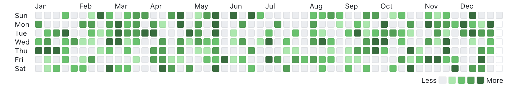
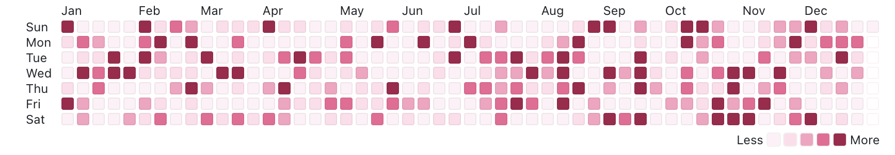
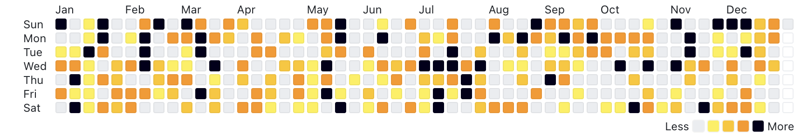
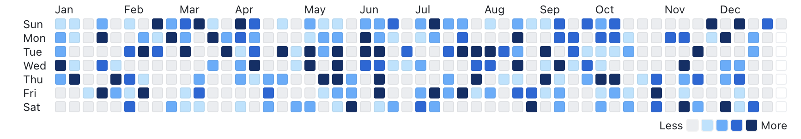
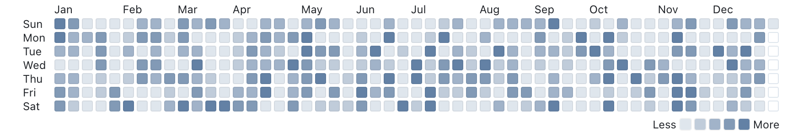
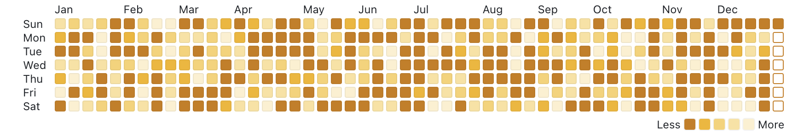
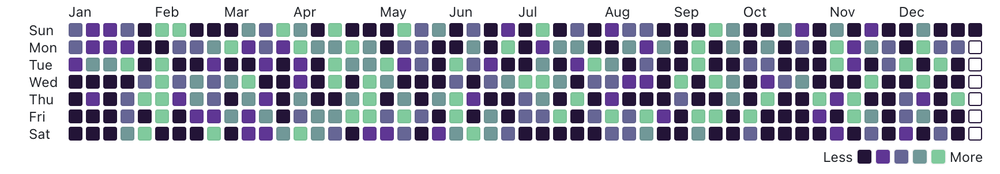
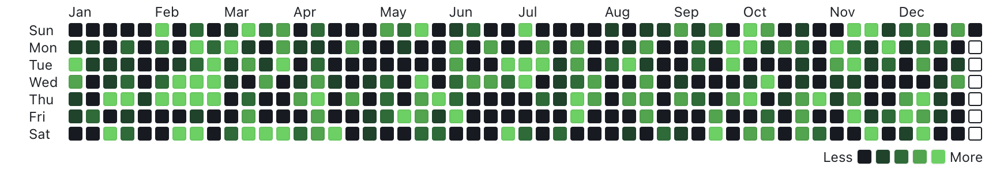
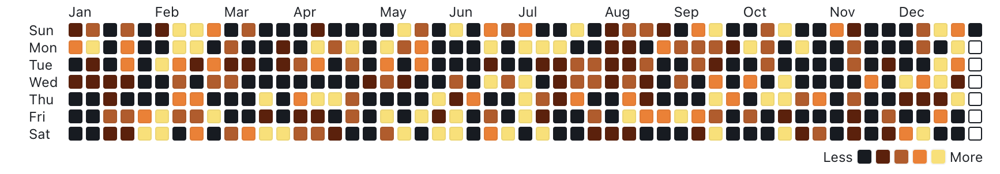
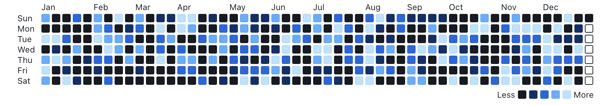

# react-contribution-calendar
A GitHub-like contribution calendar component for React, built with Vite and TypeScript. This provides a visual representation of contribution activity, similar to the contribution graph seen on a GitHub profile.

<br />   

## Installation
```bash
$ npm i react-contribution-calendar
```
> **Note**  
> Add --save if you are using npm < 5.0.0

<br />

## Usage
```js
import { ContributionCalendar } from 'react-contribution-calendar'

const data = [
  {
    '2023-07-08': {
      level: 1,
    },
  },
  {
    '2023-07-09': {
      level: 4,
      data: {},
    },
  },
  {
    '2023-12-31': {
      level: 3,
      data: {
        myKey: 'my data',
      },
    },
  },
]

<ContributionCalendar data={data} />
```

<br />

## APIs
### `ContributionCalendar`
`ContributionCalendar` is the main component of this library. It takes a data property, which is an array of objects representing the contribution data, and a theme property to customize its appearance.

- `data`: An array of objects, where each object has a date string(`YYYY-MM-DD` format) as key, and an `InputDataProps` object as value. Defaults to `[]`.

  - An example data is as follows:
    ```javascript
    const data = [
      {
        '2023-07-08': {
          level: 3,
          data: {
            myKey: 'my data',
          },
        },
      },
      {
        '2023-07-09': {
          level: 1,
        },
      },
    ]
    ```
- `theme`: Optional. A string that represents a predefined theme name, or an object with custom theme colors. Defaults to `grass`.

<br />   

### `createTheme`
`createTheme` is a helper function to create custom themes. It takes a string representing a predefined theme name or an object containing custom theme colors. This returns a theme object(`ThemeProps`).

<br />   

## Themes
You can customize the appearance of the `<ContributionCalendar />` with the theme property. We provide several built-in themes.

```javascript
// Replace `theme` attribute with belows 
<ContributionCalendar data={[]} theme={'grass'} />
```

### Light Themes
#### `grass`


#### `cherry`


#### `cherry_blossom`


#### `pink`


#### `sky`


#### `halloween`


#### `winter`


#### `purquoise`


#### `blue_pop`


#### `mustard`


<br />   

### Dark Themes
#### `dark_vomit`


#### `dark_pink`


#### `dark_blue`


#### `dark_ocean`


#### `dark_grass`


#### `dark_halloween`


#### `dark_winter`


<br />   

### Custom Theme

```javascript
import { ContributionCalendar, createTheme } from 'react-contribution-calendar'

function App() {

  /* Define your custom theme */
  const customTheme = createTheme({
    level0: "#ebedf0",
    level1: "#9be9a8",
    level2: "#40c463",
    level3: "#30a14e",
    level4: "#216e39",
  })

  return (
    <ContributionCalendar
      data={[]}
      theme={customTheme}
    />
  )
}

```

Or you can set theme properties directly,

```javascript
import { ContributionCalendar } from 'react-contribution-calendar'

function App() {
  return (
    <ContributionCalendar
      data={[]}
      theme={{
        // Assign theme properties directly
        level0: "#ebedf0",
        level1: "#9be9a8",
        level2: "#40c463",
        level3: "#30a14e",
        level4: "#216e39",
      }}
    />
  )
}
```
